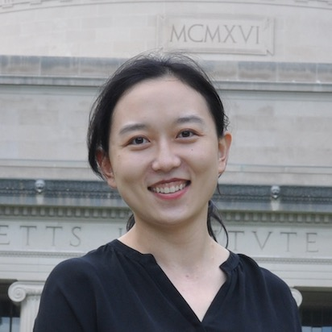

Yuanyuan Qiao is a professor in the School of Artificial Intelligence, [Beijing University of Posts and Telecommunications (BUPT)](https://english.bupt.edu.cn/), Beijing, China. She is also a member of Intelligent Perception and Computing Research Center, and Artificial Intelligence Institute of BUPT. She was a visiting scholar in [Senseable City Laboratory](http://senseable.mit.edu/) of Massachusetts Institute of Technology (MIT) during 2019 and 2020.

Contact me with: yyqiao AT bupt "dot" edu "dot" cn or qiaoy AT mit "dot" edu 

## Research Interest

- Anomaly detection
- Big data analysis in Internet and Telecom
- User behavior analysis in multiple scenarios

## Teaching

#### School of Information and Communication Engineering, BUPT

- *Deep Learning*, for undergraduates
- *Big Data Analysis Technologies and Practices*, for international students, online (I am one of the group members)
- *Fundamentals of Data Science*, for undergraduates

## Experience

- Professor, School of Artificial Intelligence, BUPT, 12/2023 - Present
- Associate Professor, School of Artificial Intelligence, BUPT, 01/2020 - 12/2023
- Visiting Scholar, Department of Urban Studies and Planning, MIT, 09/2019 - 10/2020
- Associate Professor, School of Information and Communication Engineering, BUPT, 12/2017 - 01/2020
- Assistant Professor, School of Information and Communication Engineering, BUPT, 07/2014 - 12/2017 

## Education

#### Beijing University of Posts and Telecommunications

Ph.D., Signal and Information Processing, 09/2009 - 06/2014
- Thesis: "Research and Application of Hadoop Based Network Traffic Analysis System"

#### Xidian University

B.A., Electronic Information Engineering, 09/2005 - 06/2009

## Awards

#### 2022 Xinjiang Science and Technology Progress Award

- Second prize, ranked fourth among the nine participants

#### 2020 Beijing Science and Technology Progress Award

- Second prize, ranked third among the ten participants

#### 2019 Beijing Young College Teachers' Basic Teaching Skills Competition

- Second prize
- Award for most popular with students

#### 2018 BUPT Teaching Competition

- First prize

